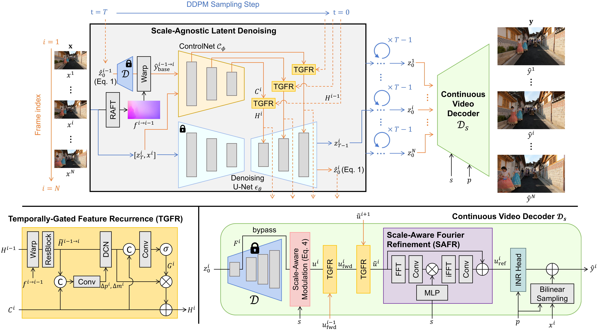
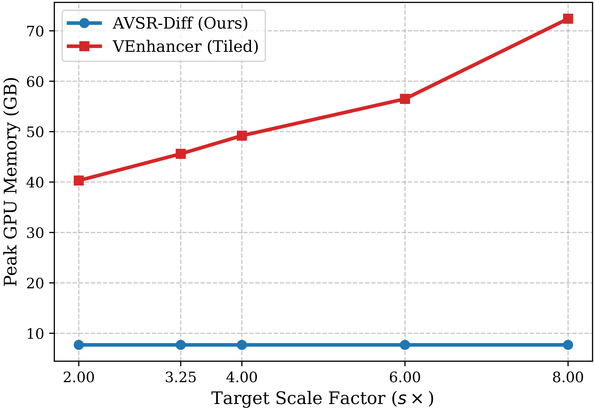

<div align="center">
<h2>AVSR-Diff (ECCV 2026)</h2>

<div>&nbsp;&nbsp;
    <a href='https://sites.google.com/view/geunhyukyouk/' target='_blank'>Geunhyuk Youk</a><sup>1</sup>&nbsp;
    <a href='https://sites.google.com/view/jeonghyeokdo' target='_blank'>Jeonghyeok Do</a><sup>1</sup>&nbsp;
    Dayeon Kim<sup>1</sup>&nbsp;
    <a href='https://sites.google.com/view/ozbro/' target='_blank'>Jihyong Oh</a><sup>† 2</sup>&nbsp;
    <a href='https://www.viclab.kaist.ac.kr/' target='_blank'>Munchurl Kim</a><sup>† 1</sup>
</div>
<div>
    <sup>1</sup>Korea Advanced Institute of Science and Technology (KAIST), South Korea
</div>
<div>
    <sup>2</sup>Chung-Ang University, South Korea
</div>
<div>
    <sup>†</sup>Co-corresponding authors
</div>
</div>

<div>
    <h4 align="center">
        <a href="https://kaist-viclab.github.io/AVSR-Diff/" target='_blank'>
        
        </a>
        <a href="https://arxiv.org/abs/XXXX.XXXXX" target='_blank'>
        
        </a>
        
    </h4>
</div>

---

<div align="center">
    <h4>
        This repository is the official implementation of "AVSR-Diff: Scale-Agnostic Diffusion Priors for Temporally Consistent Arbitrary-Scale Video Super-Resolution".
    </h4>
</div>

<div align="center">
    <p>
        👆 <b>Experience User-Interactive Comparisons:</b> Please visit our <a href="https://kaist-viclab.github.io/AVSR-Diff/"><b>Project Page</b></a> to explore more results.
    </p>
</div>

## 📧 News
- **July 1, 2026:** This repository is created.
- **June 18, 2026:** AVSR-Diff is accepted to **ECCV 2026** 🎉

## 📖 Abstract
Diffusion models have significantly advanced video super-resolution (VSR) but remain largely constrained to fixed upsampling scales. Conversely, while coordinate-based arbitrary-scale VSR methods offer scale flexibility, they inherently suffer from severe over-smoothing at large scaling factors. Integrating generative priors with continuous decoding is promising but currently hindered by severe temporal flickering caused by the stochasticity of diffusion sampling. To address this, we propose **AVSR-Diff** (Arbitrary-scale Video Super-Resolution with Diffusion), a novel decoupled framework that separates scale-agnostic latent denoising from continuous coordinate rendering, effectively avoiding computationally heavy resolution-specific sampling. Our approach introduces a **Temporally-Gated Feature Recurrence (TGFR)** module to extract strictly aligned, temporally consistent latent priors. Furthermore, we design a continuous video VAE decoder incorporating a **Scale-Aware Fourier Refinement (SAFR)** module to dynamically adapt frequency components to any target scale. Extensive experiments demonstrate that AVSR-Diff consistently preserves high-frequency details and strong temporal stability across various scales, surpassing state-of-the-art arbitrary-scale baselines. Remarkably, our framework outperforms recent fixed-scale generative models even on their native resolution.

## 🖼️ Method Overview

**AVSR-Diff** is a decoupled framework built upon a pre-trained single-image super-resolution LDM (**SD×4 Upscaler**), decomposed into two stages: **scale-agnostic latent denoising** and **arbitrary-scale continuous decoding**.

- A trainable **ControlNet** guides the frozen denoising U-Net for scale-agnostic latent denoising. The **Temporally-Gated Feature Recurrence (TGFR)** module aligns and dynamically gates recurrent features across adjacent frames, suppressing the diffusion-inherent temporal flickering.
- The denoised latent sequence is decoded by the **Continuous Video Decoder**, which employs the **Scale-Aware Fourier Refinement (SAFR)** module to conditionally modulate high-frequency details based on the target scale, enabling high-fidelity, temporally consistent rendering at any continuous resolution.

<div align="center">
    
</div>

## 📊 Results

### Memory Efficiency
AVSR-Diff performs diffusion sampling entirely within a fixed LR latent space, so its peak GPU memory stays nearly **constant** regardless of the target scale, while resolution-specific baselines (e.g., VEnhancer) grow rapidly.

<div align="center">
    
</div>

### Qualitative Comparison
Across arbitrary and large scaling factors, AVSR-Diff synthesizes sharp, faithful textures while preserving structural fidelity, without the over-smoothing of regression-based methods or the structural distortions of prior generative baselines.

<div align="center">
    
</div>

## 🚀 Code Release Plan
**The full code and pretrained models will be released soon.**

- [ ] Inference code
- [ ] Pretrained models
- [ ] Training scripts
- [ ] Evaluation scripts

## 📑 Citation
If you find AVSR-Diff useful, please consider citing:
```BibTeX
@inproceedings{youk2026avsr,
    author    = {Youk, Geunhyuk and Do, Jeonghyeok and Kim, Dayeon and Oh, Jihyong and Kim, Munchurl},
    title     = {AVSR-Diff: Scale-Agnostic Diffusion Priors for Temporally Consistent Arbitrary-Scale Video Super-Resolution},
    booktitle = {European Conference on Computer Vision (ECCV)},
    year      = {2026}
}
```

## 📬 Contact
**For any questions, please contact rmsgurkjg@kaist.ac.kr via email.**